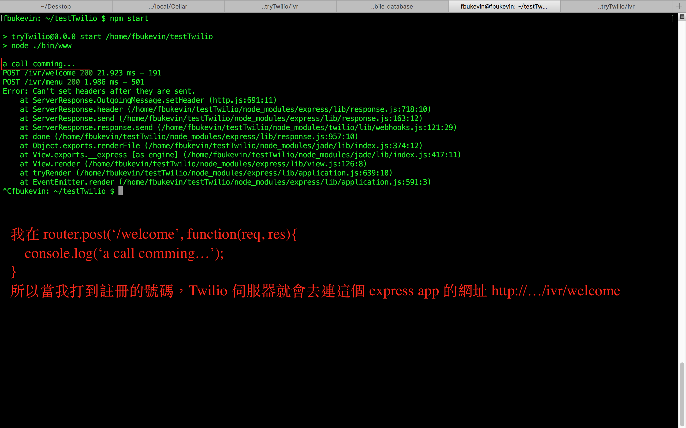
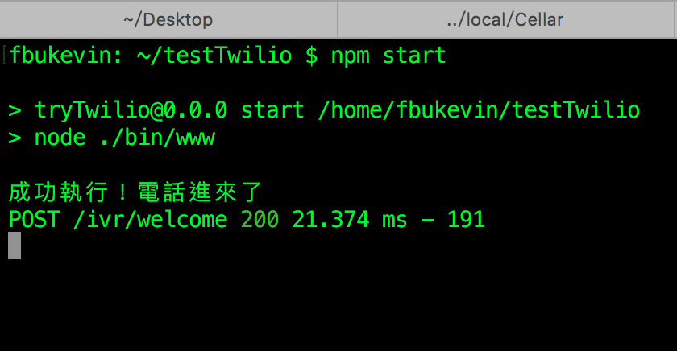

##說明

```javascript
app.js:
	var ivr = require('./routes/ivr');
	app.use('/ivr', ivr);

ivr.js:
	router.post('/', ...);			// 1
	router.post('/welcome', ...);	// 2
```

以上這樣子是連到 `/ivr` 時會導到 1，連到 `/ivr/welcome` 時會導到 2


##運作方式

```javascript
// POST: '/ivr/welcome'
router.post('/welcome', twilio.webhook({validate: false}), function (request, response) {
    console.log('a call comming...');
    // TwIML 是一個回應的設定物件
    var twiml = new twilio.TwimlResponse();  
    twiml.gather({
        action: "/ivr/menu",  // 同 form 的 action
        numDigits: "1",       // 使用者輸入的數字長度
        method: "POST"        // 同 form 的 method
    }, function (node) {
        node.play("http://howtodocs.s3.amazonaws.com/et-phone.mp3", {loop: 3}); // 回應一段語音
    });
    response.send(twiml); // 回覆這個物件
});

```

你在網站設定好你這支電話對應的 request url (如：`http://<host>:<port>/ivr/welcome`)，你打到那個電話，就會被 express routing 到 /routes/ivr.js 的 router.postg('/welcome') 中，已經測試成功可以用了！



